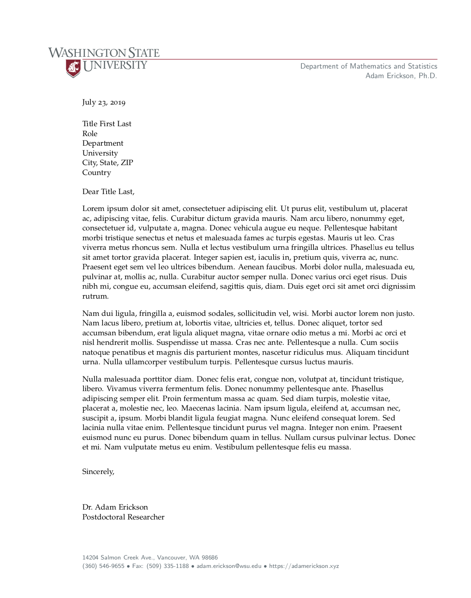

# wsu-letterhead

  

In order to use this template, copy the following files into a new directory for modification as necessary:

* main.tex
* coverletter.cls
* WSU-Logo-Primary-Blk.eps
* WSU-Logo-Primary-RGB.eps

Next, modify the `coverletter.cls` file to enter your contact information in the text block titled "FOR MODIFICATION". This will remain constant throughout the duration of your position. Once the `.cls` file has been modified, you are ready to write your first letter by modifying the `main.tex` file. Refer to the `coverletter.cls` file for a list of available fields. The `coverletter` class is based on the `article` class, with additional `documentclass` options for `bw` or `color` to specify black and white or RGB output.
